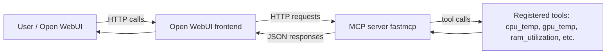

This article explains how I set up a tiny MCP (model context protocol)
server using `fastmcp` and exposed it to Open WebUI using Gemma 4, an
open source LLM from Google. The goal was to learn how model context
can be extended and enhanced through tools and the MCP standard, which\
makes it easy to plug in a wide array of external services.

### Building a Small MCP Server

I wrote a small Python service that registers a handful of system
monitoring helpers with `fastmcp`. I built a minimal Docker image so the
service can run reproducibly on the host or inside other containers. Open
WebUI acts as a lightweight frontend to self hosted LLMs that calls the MCP 
endpoints and presents the chat results.

At a high level the pieces connect like this:



`fastmcp` exposes Python functions as tools by using the `@mcp.tool`
function decorator. Finally, we call `mcp.run()`, which makes the
tools available over HTTP. For example, `cpu_temp()` reads the CPU
temperature sensor and returns a single value indicating the CPU 
temperature in celsius.

Here is the definition of my small MCP server:

```py
import psutil
import subprocess
from fastmcp import FastMCP

mcp = FastMCP("Server Tools")


@mcp.tool
def cpu_temp() -> str:
    """Gets the current temperature of the CPU in celsius"""
    temp = psutil.sensors_temperatures()["k10temp"][0].current
    return str(int(temp))


@mcp.tool
def gpu_temp() -> str:
    """Gets the current temperature of the GPU in celsius"""
    cmd = [
        "nvidia-smi",
        "--query-gpu=temperature.gpu",
        "--format=csv,noheader,nounits"
    ]
    temp = subprocess.run(cmd, capture_output=True, text=True).stdout
    return str(int(temp))


@mcp.tool
def ram_utilization() -> str:
    """Gets the current utilization of system RAM as a percentage"""
    memory = psutil.virtual_memory()
    return f"{memory.percent:.0f}%"


@mcp.tool
def vram_utilization() -> str:
    """Gets the current utilization of GPU VRAM as a percentage"""
    cmd = [
        "nvidia-smi",
        "--query-gpu=memory.used,memory.total",
        "--format=csv,noheader,nounits"
    ]
    memory = subprocess.run(cmd, capture_output=True, text=True).stdout
    memory = [int(i) for i in memory.split(", ")]
    return f"{100 * memory[0] / memory[1]:.0f}%"


@mcp.tool
def raid_status() -> str:
    """Gets the current status of RAID drives (assumes RAID 6 4 drive array)"""
    cmd = ["cat", "/proc/mdstat"]
    raid = subprocess.run(cmd, capture_output=True, text=True).stdout
    status = "[4/4] Drives Online" if "[UUUU]" in raid else "Drive Malfunction!"
    return status


if __name__ == "__main__":
    mcp.run(transport="http", host="0.0.0.0", port=8000)
```

Then, in Open WebUI I registered a new *slash command* with Gemma 4. Simply
put, slash commands are prompts which can be used in an LLM chat. In this case,
if I opened a new chat in Open WebUI with Gemma 4 (an open source model from
Google which I self hosted on my server) I can type `/server-status` in the
chat window. That would initialize this prompt:

````
Use the `server-tools` MCP to generate the following table. Do not add any
additional context, commentary, or exposition beyond what is described below.
Be sure to format the resulting table as a markdown table so it is readable:

```md
| Component | Reading | Critical |
| ------------ | -------- | ------- |
| CPU Temp | <reading from cpu_temp> | <whether this is too hot> |
| GPU Temp | <reading from gpu_temp> | <whether this is too hot> |
| RAM Utilization | <reading from ram_utilization> | <whether this is too much> |
| VRAM Utilization | <reading from vram_utilization> | <whether this is too much> |
| RAID Status | <reading from raid_status> | <whether it is not working as intended> |
```
````

The model then returns a clean, live update of the server metrics directly in the chat:

 Component | Reading | Critical |
| ------------ | -------- | ------- |
| CPU Temp | 54 | No |
| GPU Temp | 59 | No |
| RAM Utilization | 17% | No |
| VRAM Utilization | 37% | No |
| RAID Status | [4/4] Drives Online | No |

### Real World MCPs

As a concrete example of a production MCP server, consider the Polars
MCP server. The Polars MCP gives LLMs direct context about how `polars`
code is written in Python. An LLM with access to the Polars MCP will
write significantly more consistent and up to date `polars` code because
it can consult an LLM friendly version of the latest docs at
`https://mcp.pola.rs/mcp`.

MCP servers are a powerful way for individuals and organizations to extend
LLMs using external functions and services with MCP tools. This can significantly
enhance the reliability and performance of frontier and self hosted models alike.
